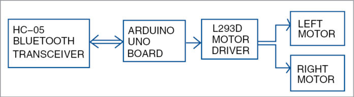

# Voice-assisted-cum- Obstacle detection miniature vehicle
 
Description 
The main objective of this project is to develop an IoT device/vehicle that obeys the command from the user’s voice through an
                   	 Android application and acts According to the instructions.      
Technologies used	: Arduino UNO, HC-05(Bluetooth module), Generic MotorcontrollerL293d.  
Tool		: Arduino IDE 1.8.15, BT voice control for Arduino. 

# Interface Approach

# Block Approach

